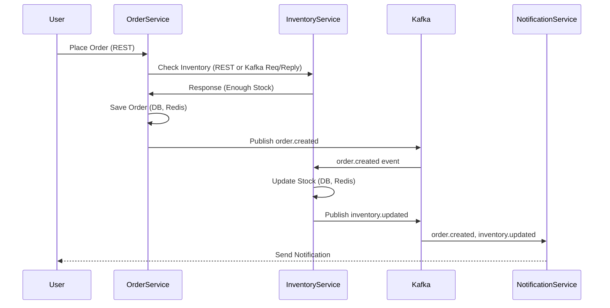

# Order & Inventory Management System — Microservices Architecture

## 1. Architecture Overview

### Microservices

- **Order Service:** Handles order placement, updates, and queries.
- **Inventory Service:** Manages product inventory and stock updates.
- **Product Service:** CRUD for products.
- **Customer Service:** Manages customer records.
- **Notification Service:** Sends notifications based on events.

### Tech Stack

- **Spring Boot** (Java) for all services
- **PostgreSQL** for persistence (one DB per service schema)
- **Redis** for caching
- **Kafka** for asynchronous event-driven communication
- **REST APIs** for synchronous communication
- **Docker Compose** for local orchestration
- (Optional: **Spring Cloud Config**, **Consul/Eureka** for config/service discovery)

---

## 2. Detailed Component Design

### Order Service

- REST APIs to place, update, and fetch orders.
- Checks inventory via REST or Kafka request/reply.
- Publishes `order.created` and `order.updated` events to Kafka.
- Caches recent orders in Redis.
- Persists orders in PostgreSQL.

### Inventory Service

- REST APIs & Kafka listeners for stock updates.
- On `order.created`, decrements stock.
- Publishes `inventory.updated` to Kafka.
- Caches product stock levels in Redis.
- Persists inventory data in PostgreSQL.

### Product Service

- CRUD for products via REST.
- Caches product details in Redis.
- Persists products in PostgreSQL.

### Customer Service

- CRUD for customers.
- Persists customer data in PostgreSQL.

### Notification Service

- Listens to Kafka events (`order.created`, `inventory.updated`).
- Sends emails, SMS, etc.
- (Optional: persists logs in DB)

---

## 3. Data Flow Example: Placing an Order

1. **User** calls Order Service (REST)
2. **Order Service:**  
   - Validates order, fetches product/inventory info (REST or Kafka sync call to Inventory Service).
   - If stock sufficient, creates order (DB, Redis cache).
   - Publishes `order.created` event to Kafka.
3. **Inventory Service:**  
   - Consumes `order.created` from Kafka, decrements stock (DB, Redis).
   - Publishes `inventory.updated` event to Kafka.
4. **Notification Service:**  
   - Consumes events, sends notifications.

---

## 4. Step-by-Step Implementation Guide

### Step 1: Local Infrastructure (Docker Compose)

```yaml
version: '3.8'
services:
  postgres:
    image: postgres:15
    environment:
      POSTGRES_USER: myuser
      POSTGRES_PASSWORD: mypassword
      POSTGRES_DB: mydb
    ports:
      - "5432:5432"
    volumes:
      - pgdata:/var/lib/postgresql/data

  redis:
    image: redis:7
    ports:
      - "6379:6379"

  zookeeper:
    image: wurstmeister/zookeeper:3.4.6
    ports:
      - "2181:2181"

  kafka:
    image: wurstmeister/kafka:2.13-2.8.0
    ports:
      - "9092:9092"
    environment:
      KAFKA_BROKER_ID: 1
      KAFKA_ZOOKEEPER_CONNECT: zookeeper:2181
      KAFKA_ADVERTISED_LISTENERS: PLAINTEXT://localhost:9092
      KAFKA_OFFSETS_TOPIC_REPLICATION_FACTOR: 1
    depends_on:
      - zookeeper

volumes:
  pgdata:
```

---

### Step 2: Bootstrap Spring Boot Projects

- Use [Spring Initializr](https://start.spring.io/) or your IDE.
- Separate Maven/Gradle projects for each service.
- Dependencies: Spring Web, Spring Data JPA, PostgreSQL Driver, Redis, Kafka, Lombok, Actuator, etc.

---

### Step 3: Define Domain Models and Repositories

- Each service defines its own `@Entity` classes and Spring Data repositories.

---

### Step 4: Configure `application.yml`

Each service example:

```yaml
spring:
  datasource:
    url: jdbc:postgresql://localhost:5432/orderdb
    username: myuser
    password: mypassword
  redis:
    host: localhost
    port: 6379
  kafka:
    bootstrap-servers: localhost:9092
server:
  port: 8081 # change per service
```

---

### Step 5: Implement REST APIs and Kafka Producers/Consumers

- Use `@RestController` for REST endpoints.
- Use `KafkaTemplate` for producing events.
- Use `@KafkaListener` for consuming events.
- Use RedisTemplate or Spring Cache for caching.

---

### Step 6: Inter-Service Communication

- Use REST (OpenFeign or RestTemplate) for sync calls.
- Use Kafka topics for async/event-driven flows.

---

### Step 7: Test Locally

- Start Docker Compose:  
  `docker-compose up -d`
- Run each service (`mvn spring-boot:run` or dockerize).
- Test APIs with Postman or cURL.

---

### Step 8: (Optional) API Gateway, Service Registry, Security

- Use Spring Cloud Gateway or Zuul for API Gateway.
- Eureka/Consul for service discovery.
- Spring Security/JWT for authentication.

---

## 5. Sample Repository Structure

```
order-inventory-system/
  docker-compose.yml
  order-service/
  inventory-service/
  product-service/
  customer-service/
  notification-service/
  common-lib/   # (optional for DTOs/utilities)
```

---

## 6. Example Sequence Diagram



---

## 7. Development Tips

- Keep services stateless and independent.
- Use Docker Compose for infrastructure.
- Each service should have its own DB schema.
- Use Spring Profiles for environment-specific configs.
- Use shared libraries for DTOs only if necessary.

---

## 8. Next Steps

- Implement skeleton Spring Boot apps for each service.
- Create sample data models and REST endpoints.
- Set up Kafka listeners/producers.
- Add Redis caching for frequently accessed data.
- Test the end-to-end flow.

---

**Need code samples, Dockerfiles, or a starter repo? Let me know!**